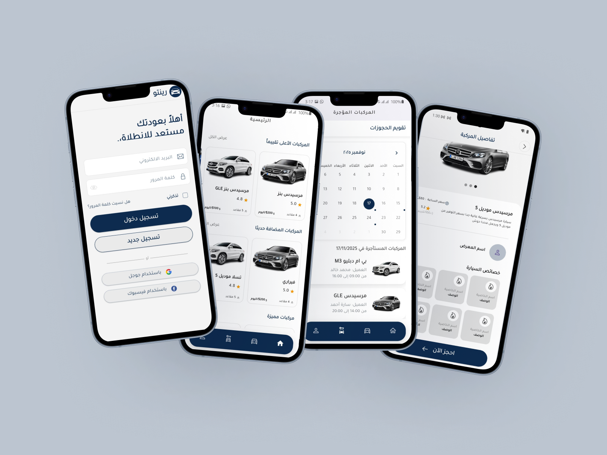
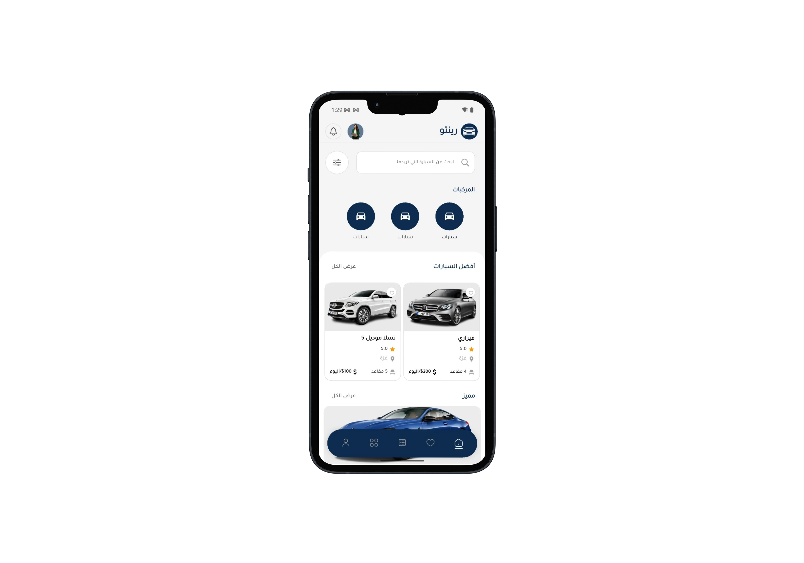
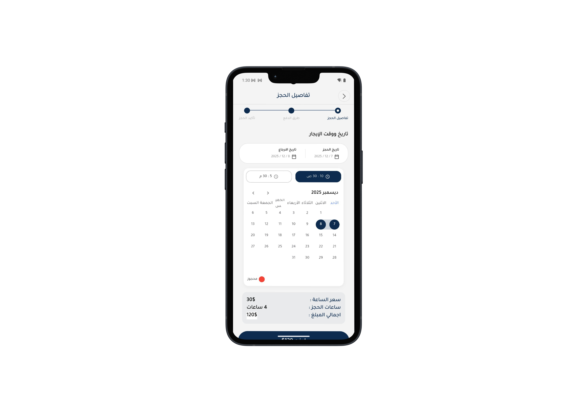

# 🚗 Vehicle Rental Flutter App - Rento App

## 📌 Project Overview
* **General View**
  
This project implements a **cross-platform Vehicle Rental Mobile Application (MVP)** using **Flutter, GetX, and Dio**.
The app allows **customers** to browse and book vehicles, **agencies** to manage their fleet, and **administrators** to supervise operations via a Laravel-based web dashboard.

The system supports **multi-role access, secure authentication, dynamic themes, and real-time booking management**, and is designed as a **functional MVP** to validate core features.

---

## 🎯 Objectives

* Build a **Minimum Viable Product (MVP)** for vehicle rentals
* Implement **multi-role access**: Customer, Agency, Admin
* Enable **secure login**, social login (Google/Facebook), and email verification
* Manage **bookings, payments, and notifications** efficiently
* Build responsive and intuitive **UI/UX**
* Ensure scalability and performance with **GetX state management** and **Dio** for API calls

---

## 👤 Actors & Roles

* **Customer:** Browse, book, rate vehicles, manage profile
* **Agency:** Add/edit/delete vehicles, manage agency profile
* **Admin:** Approve/reject users and agencies, full system oversight

---

## 🏗️ App Architecture

* **Frontend:** Flutter, Dart
* **Backend:** Laravel PHP
* **Database:** MySQL
* **State Management:** GetX
* **Networking / API Calls:** Dio
* **Authentication:** Email verification, OAuth (Google/Facebook)

---

## ⚙️ Technologies Used

* Flutter / Dart
* GetX (state management & routing)
* Dio (HTTP client & API integration)
* Laravel PHP
* MySQL
* Git / GitHub

---

## 📂 Project Structure

```
Vehicle_Rental_App/
│
├── lib/
│   ├── agency/               # Agency-related screens & logic
│   ├── bindings/             # GetX bindings for dependency injection
│   ├── core/                 # Core utilities & constants
│   ├── customer/             # Customer-related screens & logic
│   ├── model/                # Data models
│   ├── screens/              # Shared screens
│   ├── utils/                # Helper functions
│   ├── widgets/              # Reusable widgets
│   ├── app.dart              # Main app configuration
│   ├── app_start_controller.dart  # App initialization with GetX
│   └── main.dart             # Entry point
├── assets/                   # Images, icons, fonts, mockups
├── android/                  # Android project files
├── ios/                      # iOS project files
├── test/                     # Unit & widget tests
├── .dart_tool/
├── build/
├── pubspec.yaml              # Project dependencies
├── pubspec.lock
├── LICENSE
└── README.md
```

---

## 📋 Functional Requirements

### Customer Functionalities

* Register/login with email, Google, or Facebook
* Verify account via email
* Reset password via email or re-authentication
* View/edit profile information
* Browse agencies and vehicles
* Add vehicles to booking cart
* Place bookings with payment options
* View booking history & status
* Rate and review experience
* Receive in-app notifications
* Change app theme (Dark/Light)
* Logout

### Agency Functionalities

* Register/login with email, Google, or Facebook
* Verify account via email & admin approval
* View/edit agency profile
* Add/edit/delete vehicles
* Activate/deactivate vehicles
* Receive in-app notifications for bookings and payments
* Change app theme (Dark/Light)
* Logout

### Admin Functionalities (Web Dashboard)

* Secure login/logout
* View and manage all users and agencies
* Approve/reject accounts
* Full CRUD capabilities for all entities
* Monitor system activities

---

## 📈 Use Cases

### Customer

* **Register / Login** – Create account, access app
* **Verify Account** – Activate via email
* **Social Login** – Login with Google/Facebook
* **Reset Password** – Update forgotten password
* **Edit Profile** – Update personal info
* **Place Booking** – Select vehicle, period, payment
* **View Booking Status** – Track active and past bookings

### Agency

* **Register / Login** – Create agency account
* **Manage Vehicles** – Add, edit, delete vehicles
* **Activate/Deactivate Vehicle** – Control availability

### Admin

* **User & Agency Management** – Approve, restrict, delete accounts
* **Full Control** – Edit, approve, delete any entity

---

## 🎨 Mockups

* **Customer Home Screen**
  

* **Agency Dashboard**
  

* **Booking Flow**
  


---

## ▶️ How to Run

### 1️⃣ Install Flutter

Follow the official guide: [Flutter Installation](https://flutter.dev/docs/get-started/install)

### 2️⃣ Install dependencies

```bash
flutter pub get
```

### 3️⃣ Configure Backend

Update `.env` or API constants in `lib/core/` with Laravel API URL.

### 4️⃣ Run App

```bash
flutter run
```

---

## 📚 MVP Context

This project is developed as a **Minimum Viable Product (MVP)** to validate the core features of a Vehicle Rental application.
It is **not purely for educational purposes**, and is intended to demonstrate functional usability and multi-role system workflow.

---

## 👤 Author

Samer Abu Zaina
Flutter & Mobile Developer

Roaa Abu Foul
Flutter & Mobile Developer

---

## ⭐ License

This project is an **MVP prototype** and intended for demonstration, testing, and portfolio purposes.

---
